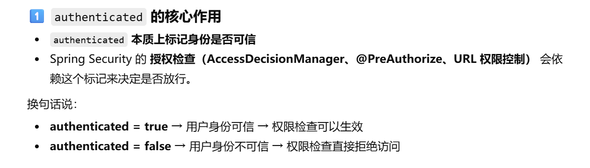
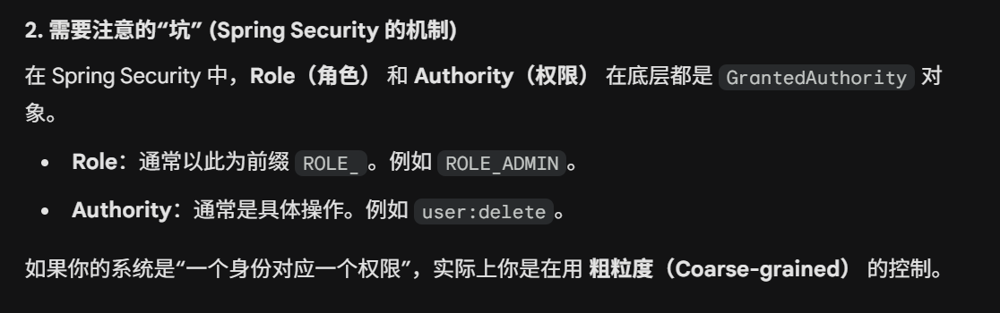
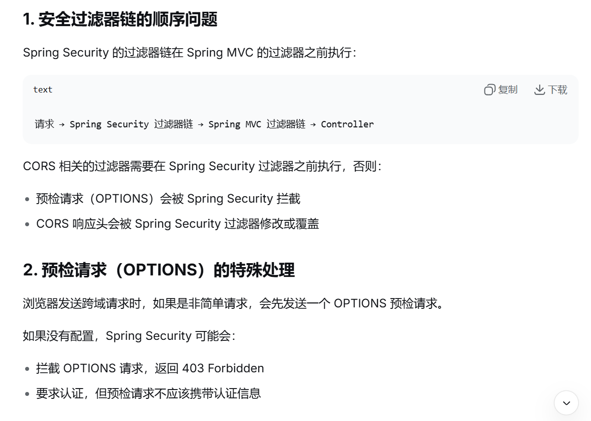

# MyBlog 后端搭建
## 1 项目初始化
  使用xfg提供的DDD脚手架搭建
## 2 微信登录
### 2.1 微信登录流程
1. 前端发送获取微信二维码请求
   2. 后端接收到请求，根据自己的appId，向微信服务器发送请求获取 accessToken(redis 2小时有效期)，将<appId, accessToken>保存(2小时)
2. 后端将accessToken发送微信服务器获取ticket(2小时有效期)，发送给前端
3. 前端接收到ticket，根据ticket向微信服务器获取二维码图片
4. 微信服务器接收到用户扫描了登录二维码，将openId(30天有效期)发送给后端，后端保存<ticket, openId>(redis 2小时)
5. 前端不断轮询后端，依据ticket查询是否保存了openId，将openId保存30天
6. 前端接收到了openId，说明用户已经登录可以跳转到登录页面

### 2.2 难题:appId, accessToken, ticket, openId的认识？

## 3 网站用户注册登录
### 3.1 SpringSecurity+JWT介绍

### 3.2 SpringSecurity+JWT项目实现 （认证与授权）
第一阶段：登录流程 (获取 Token)这是用户拿着用户名和密码来换取“通行证”的过程。  
1. 发起请求：客户端（前端）发送 POST /auth/login，携带 JSON 数据 {"username": "admin", "password": "123"}。
2. 放行：请求到达后端，经过 JwtAuthenticationFilter。因为请求路径是 /auth/login，且没有 Token，过滤器什么都不做，直接放行（在 SecurityConfig 中配置了 .permitAll()）。
3. Controller 接待：请求到达你的 AuthController。
4. 委托安保：Controller 调用 authenticationManager.authenticate(token)。
5. 内部查验 (Spring Security 核心内部运作)：AuthenticationManager 找到 DaoAuthenticationProvider。
6. Provider 调用你写的 UserDetailsService 去数据库查出真实的 User（包含加密后的密码）。
7. Provider 调用 PasswordEncoder 比对用户输入的 "123" 和数据库里的 "$2a$10$..."。
8. 签发证书：如果你密码正确，authenticate() 方法通过。Controller 调用 JwtUtil.generateToken()，生成一个加密字符串（JWT）。
9. 返回：服务端将 JWT 字符串返回给客户端。客户端将其保存在 LocalStorage 或 Cookie 中。

第二阶段：访问受保护资源 (携带 Token)这是用户平时点击页面、获取数据的过程。此时用户已经有了 Token。
1. 发起请求：客户端发送 GET /api/admin/users。关键动作：在 HTTP Header 中携带 Authorization: Bearer <你的JWT字符串>。
2. 第一道关卡：JwtAuthenticationFilter (你写的过滤器)拦截：请求刚进门就被这个过滤器拦住。
3. 解析：过滤器从 Header 拿出 Token，调用 JwtUtil 验证签名是否合法、是否过期。
4. 拿人：解析出 username = "admin"。
5. 确认：过滤器调用 UserDetailsService 确认用户依然存在（这一步可选，但更安全）。
6. 授权（最关键的一步）：过滤器构建一个 UsernamePasswordAuthenticationToken 对象（包含用户信息 + 权限列表 ROLE_ADMIN）。
7. 盖章：调用 SecurityContextHolder.getContext().setAuthentication(auth)。含义：这就好比给这次请求挂上了一个“已认证”的胸牌。Spring Security 后续的所有组件看到这个胸牌，就知道你是谁了。
8. 第二道关卡：AuthorizationFilter (Spring 内置)请求继续往后走，遇到权限检查器。它读取 SecurityConfig 中的规则：.requestMatchers("/api/admin/**").hasRole("ADMIN")。
9. 它查看你胸牌（SecurityContext）里的权限，发现你有 ROLE_ADMIN。放行。
10. 到达业务层：请求终于到达 AdminController 的 getUsers() 方法。返回数据：Controller 执行业务逻辑，返回 JSON 数据。

**重点**
public UsernamePasswordAuthenticationToken(Object principal, Object credentials, Collection<? extends GrantedAuthority> authorities)
这种构造方法构造出来，也就是直接携带权限的authorities的Authentication默认会设置其已授权，也就是isAuthenticated为true

UsernamePasswordAuthenticationToken(*, *, authorities)与UserDetail.getAuthorities的区别：

|特性 |	UserDetails.getAuthorities()|	UsernamePasswordAuthenticationToken第3个参数|
|---|---|---|
|角色定位	|数据模型层 (Data Definition)|安全上下文层 (Security Context)|
|含义	|代表该用户在数据库/存储中应该拥有的权限。	|代表该用户在当前会话/请求中实际生效的权限。|
|使用时机	|通常在登录认证（UserDetailsService）时被调用，用于构建认证对象。	|在构建最终的 Authentication 对象放入 SecurityContextHolder 时使用。|
|鉴权依据	|Spring Security 鉴权过滤器不直接看这个。	|Spring Security 的鉴权过滤器（如 FilterSecurityInterceptor）只看这个。|

SpringSecurity身份（Role）与权限（Authories)

|代码构造|Controller 里的注解写法|解释|
|---|---|---|
|new SimpleGrantedAuthority("ROLE_ADMIN")|@PreAuthorize("hasRole('ADMIN')")推荐。|Spring 会自动帮你去掉/加上 ROLE_ 前缀来匹配。|
|new SimpleGrantedAuthority("ADMIN") | @PreAuthorize("hasAuthority('ADMIN')")|如果你不加 ROLE_ 前缀，就必须用 hasAuthority。|

### 3.3 用户登录功能实现
配置了 Spring Security 后需要专门处理 CORS（跨域资源共享）问题: 在发送跨域请求时，会提前发送一个OPTIONS请求，会被SpringSecurity拦截
